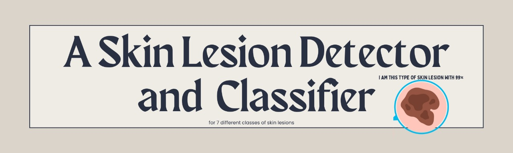
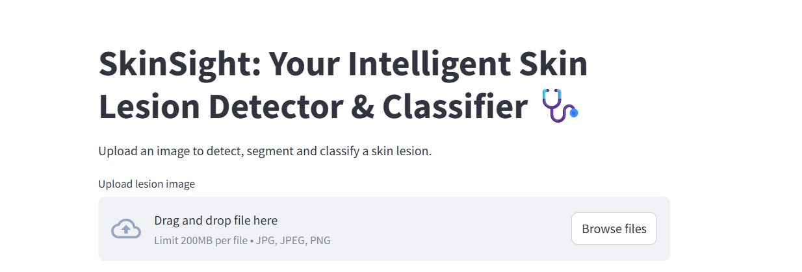
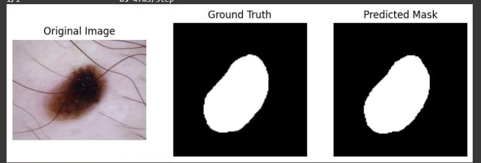
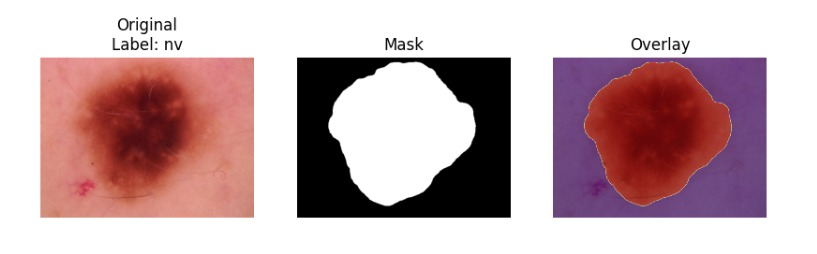
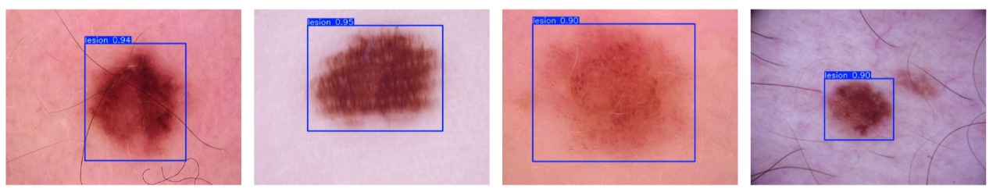
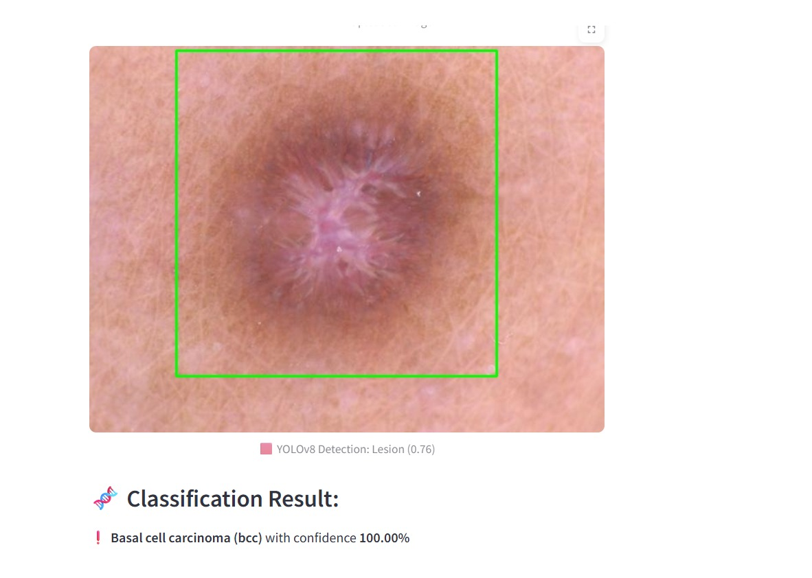
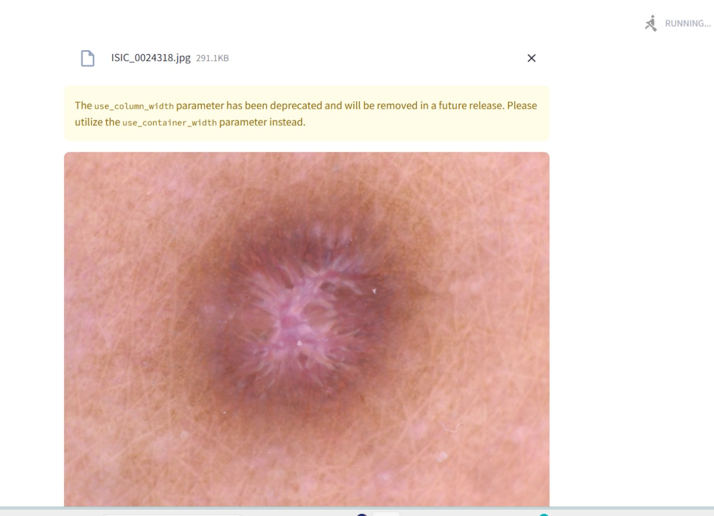

<h1 align="center">🧠 SkinSight – AI Skin Lesion Detector & Classifier</h1>

<p align="center">
  
</p>

---

## 📌 Overview

**SkinSight** is a full pipeline for automatic skin lesion analysis using Deep Learning.  
It detects, segments, and classifies skin lesions in dermatoscopic images using a combination of:
- YOLOv8 (Object Detection)
- U-Net (Segmentation)
- ResNet50 / VGG16 (Classification)

---

## 📽️ Demo
<p align="center">
  🎬 <a href="https://drive.google.com/file/d/1kF2KPf4Nm-2C5Ma5wmeLVSF0YA-Ppwbp/view?usp=drive_link" target="_blank">Watch the demo video on Google Drive</a>
</p>


## 🖥️ App Interface

<p align="center">
  
</p>

---

## 📂 Dataset

- **Name**: HAM10000  
- **Images**: 10,015 dermatoscopic images  
- **Classes**: 7 lesion types-> Melanocytic nevi, Basal cell carcinoma, Melanoma, Vascular lesions, Dermatofibroma, Benign keratosis-like lesions, Actinic keratose.
- **Sources**:
  - [HAM10000 Official](https://www.kaggle.com/datasets/kmader/skin-cancer-mnist-ham10000)
  - [Lesion Segmentations](https://www.kaggle.com/datasets/tschandl/ham10000-lesion-segmentations)

---

## 🛠️ Workflow

### <kbd>0️⃣ Data Preprocessing</kbd>
- **Input**: RAW images from HAM10000
- **Steps**: resizing, normalization, data augmentation (flip/rotate/brightness)
- **Split**: train / val / test using stratified sampling  

---

### <kbd>1️⃣ Segmentation – U-Net</kbd>

<p>
  
  
</p>

- **Input**: Original dermatoscopic image  
- **Output**: Binary mask of lesion  
- **Metric**: Dice Coefficient, IoU

---

### <kbd>2️⃣ Object Detection – YOLOv8</kbd>

<p align="center">
  
</p>

- **Task**: Detect lesion bounding boxes in image  
- **Output**: Image with bounding box + confidence  
- **Metric**: mAP@0.5

---

### <kbd>3️⃣ Classification – ResNet50 / VGG16</kbd>

<p align="center">
  
</p>

- **Task**: Classify lesion into one of 7 types  
- **Output**: Predicted class + probability  
- **Metric**: Accuracy, F1-score

---

### <kbd>4️⃣ User Interface</kbd>

<p align="center">
  
</p>

- User uploads image  
- Full pipeline runs: Segmentation ➜ Detection ➜ Classification  
- Results shown interactively with visual feedback

---

## 📊 Results

| Task           | Model              | Metric            | Score |
|----------------|--------------------|--------------------|--------|
| Segmentation   | U-Net              | Dice Coefficient   | 0.93   |
| Detection      | YOLOv8s            | mAP@0.5            | 0.99   |
| Classification | ResNet50 / VGG16   | Accuracy           | 0.96   |

---

## 👥 Team Members

- **🧪 Rania Elsayed** — Segmentation using U-Net and mask preprocessing
- **🔍 Jasmine Mohamed** — Object Detection (YOLOv8) & full pipeline integration in Streamlit
- **📊 Nesma Nasser** — Data Analysis and Preprocessing & Classification using ResNet50 analysis and evaluation
- **🧠 Bassant Elsayed** — Classification model using VGG16 / MobileNetv2 and data balancing

---

## 🧠 Summary of Each Model by Function

| Model        | Purpose                            | Input                  | Output            |
|--------------|------------------------------------|------------------------|-------------------|
| 🧬 U-Net     | Segment lesion region (masks)      | Full image             | Binary mask       |
| 🎯 YOLOv8    | Detect lesion position (bounding box) | Full image         | Bounding box + conf |
| 🧾 ResNet / VGG | Predict lesion type              | Cropped box image      | One of 7 skin types |

---

## 💡 Future Improvements

- Train segmentation with true U-Net+ pretrained encoder  
- Add Grad-CAM visualization for classification explainability  
- Deploy full app to Streamlit Cloud  
- Support real-time image webcam inputs

---

## 🚀 Run the App

Make sure you have streamlit & dependencies:

```bash
pip install streamlit ultralytics tensorflow opencv-python
streamlit run app.py
 ```
